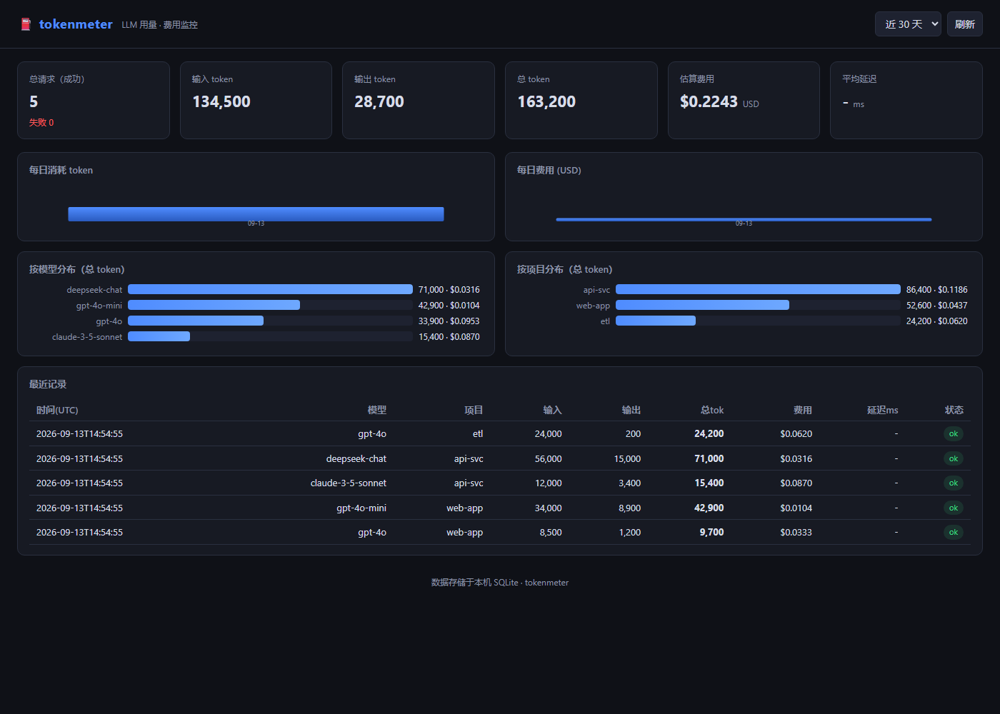

<div align="center">

# ⛽ tokenmeter

**Local-first LLM usage & cost monitor — zero third-party dependencies.**

Track every token and every dollar your LLM API calls burn, entirely on your own machine.

`Python 3.8+` · `SQLite` · `Zero pip installs` · `Zero npm` · `Zero cloud`

[Features](#-features) · [Quick start](#-quick-start) · [Proxy mode](#-transparent-proxy-mode) · [Dashboard](#-web-dashboard) · [Report](#-reports) · [Pricing](#-pricing) · [FAQ](#-faq)

</div>

---

> **What problem does this solve?** You wire an app to GPT / Claude / DeepSeek / any OpenAI-compatible API.
> Three weeks later you get a bill and have no idea which model, which project, or which day burned the budget.
> `tokenmeter` answers that locally: one SQLite file, a CLI, a web dashboard, and an opt-in transparent
> proxy that records every request with **zero changes to your business code**.

## ✨ Features

| Feature | What it does |
|---|---|
| 🗄️ **SQLite storage** | All usage lives in `~/.tokenmeter/usage.db`. Your data never leaves your machine. |
| 🖥️ **CLI** | `record` / `report` / `prices` / `serve` / `proxy` / `clear` — everything from one command. |
| 🔄 **Transparent proxy** | Point `base_url` at the local proxy → every request is forwarded *and* billed automatically. Streaming (SSE) supported. |
| 📊 **Web dashboard** | Zero-dependency HTML+SVG charts: totals, daily trend, per-model & per-project breakdown, recent calls. |
| 💰 **Built-in pricing** | 17 mainstream models priced out of the box; override any model with your real contract price. |
| 📤 **Reports** | Terminal tables, JSON / CSV / Markdown export. |
| 🔒 **Private by design** | Listens on `127.0.0.1` only. No telemetry, no accounts, no cloud. |

## 🚀 Quick start

```bash
# no install needed — run straight from the repo
git clone https://github.com/la2278647-arch/tokenmeter.git
cd tokenmeter

# or install as a package (still zero runtime deps)
pip install .
```

### 1 · Record a call manually

```bash
tokenmeter record --model gpt-4o --project web-app \
    --prompt-tokens 8500 --completion-tokens 1200
```

### 2 · See where the money went

```bash
tokenmeter report --group model --daily --recent 10
```

```
  tokenmeter · 用量报告
==============================================================
  总请求      5
  总输入      134,500 tok
  总输出      28,700 tok
  总消耗      163,200 tok
  估算费用    $0.2243
...
+-------------------+----+--------+--------+--------+---------+
| 维度             | 请求 | 输入tok | 输出tok | 总tok   | 费用    |
+-------------------+----+--------+--------+--------+---------+
| deepseek-chat     | 1  | 56,000 | 15,000 | 71,000 | $0.0316 |
| gpt-4o-mini       | 1  | 34,000 |  8,900 | 42,900 | $0.0104 |
...
```

### 3 · Open the dashboard

```bash
tokenmeter serve
# → http://127.0.0.1:8765/
```



## 🔄 Transparent proxy mode

The killer feature: **zero code changes** to your app. Instead of calling the API directly, point your
client's `base_url` at tokenmeter and every call is forwarded *and* recorded.

```bash
# 1. start the proxy (defaults to OpenAI as upstream)
tokenmeter proxy --upstream https://api.openai.com --port 8787
```

```python
# 2. your app — only the base_url changes
from openai import OpenAI

client = OpenAI(
    base_url="http://127.0.0.1:8787/v1",   # ← tokenmeter in the middle
    api_key="sk-your-real-key",             # ← passed through untouched
)
resp = client.chat.completions.create(
    model="gpt-4o",
    messages=[{"role": "user", "content": "Hello"}],
)
# 3. done — tokenmeter just recorded prompt/completion tokens + estimated cost
```

Tag calls by project with an HTTP header:

```bash
curl http://127.0.0.1:8787/v1/chat/completions \
  -H "Content-Type: application/json" \
  -H "Authorization: Bearer sk-..." \
  -H "X-Project: my-service" \
  -d '{"model":"gpt-4o","messages":[{"role":"user","content":"hi"}]}'
```

**Streaming works too** — tokenmeter transparently injects `stream_options.include_usage=true` and reads
the usage from the tail chunk, so SSE calls are never under-counted.

## 📊 Web dashboard

| Endpoint | Returns |
|---|---|
| `/` | Single-page dashboard (HTML+SVG, no CDN) |
| `/api/summary` | Totals: requests, tokens, cost, latency, errors |
| `/api/by-model` | Breakdown per model |
| `/api/by-project` | Breakdown per project |
| `/api/daily` | Daily time series |
| `/api/recent` | Latest N records |

Filter everything by time window from the page header (7 / 30 / 90 / 365 days).

## 📤 Reports

```bash
tokenmeter report --export usage.json          # JSON
tokenmeter report --export usage.csv           # CSV (utf-8-sig, Excel-friendly)
tokenmeter report --export usage.md            # Markdown table
tokenmeter report --since 2026-09-01 --project web-app   # filter
tokenmeter report --group project --daily --recent 20    # multi-view
```

## 💰 Pricing

17 models are priced out of the box (USD per 1M tokens): GPT-4o, GPT-4o-mini, GPT-4.1, o3-mini,
Claude 3.5/3.7 Sonnet, Claude Sonnet 4, DeepSeek chat & reasoner, Gemini 1.5 Pro / 2.0 Flash,
Qwen turbo/plus/max, Mistral Large, Llama 3.3 70B.

```bash
tokenmeter prices                       # list all prices
tokenmeter prices --set my-model 3.00 6.00   # set your own contract price
```

Models without a listed price are estimated at $1.00 / 1M (clearly marked `*`), so you can start
tracking immediately and refine later. **All estimates are estimates** — treat them as guidance, not an invoice.

## 🧪 Development

```bash
python -m unittest discover -s tests -v     # 12 tests, incl. end-to-end proxy billing
```

## ❓ FAQ

**Do I need to install anything?** No. The whole project runs on the Python standard library.

**Is my API key safe?** Yes — the proxy forwards your key upstream and never stores it.

**Does it support non-OpenAI providers?** Any provider with an OpenAI-compatible
`/v1/chat/completions` endpoint (DeepSeek, Qwen, local vLLM, gateways, …) works as an upstream.

**Where is the data?** `~/.tokenmeter/usage.db`. Back it up, move it, or point `--db` anywhere you like.

## 🧰 CLI reference

| Command | Description |
|---|---|
| `tokenmeter record …` | Record one usage entry |
| `tokenmeter report …` | Aggregate report (table / json / csv / md) |
| `tokenmeter serve` | Start web dashboard on `127.0.0.1:8765` |
| `tokenmeter proxy …` | Start transparent billing proxy on `127.0.0.1:8787` |
| `tokenmeter prices [--set M IN OUT]` | List / set model prices |
| `tokenmeter clear` | Wipe usage records (keeps prices) |

## License

[MIT](LICENSE) © la2278647-arch
